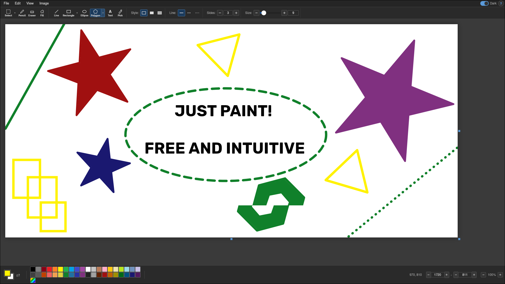

# LS Paint

A lightweight, native Linux paint application. Think MS Paint, but it runs on your Linux box and doesn't ask you to sign into a Microsoft account.



**It draws things.** Pencil, eraser, shapes, polygons, stars, text with rich formatting — the whole circus.
**It selects things.** Rectangle, ellipse, or freehand lasso. Move, stretch, rotate, copy-paste. Ctrl+drag to clone like a photocopier from 1998.
**It stays out of your way.** Dark mode, zoom, keyboard shortcuts, drag & drop images. No subscriptions, no cloud, no AI. Just paint.

## Build

You need GTK3 and WebKitGTK. That's it.

### Arch Linux

```bash
sudo pacman -S gtk3 webkit2gtk-4.1 base-devel
```

### Ubuntu / Debian

```bash
sudo apt install build-essential libgtk-3-dev libwebkit2gtk-4.1-dev
```

### Fedora

```bash
sudo dnf install gtk3-devel webkit2gtk4.1-devel gcc make
```

### Compile & Run

```bash
git clone https://github.com/tamasczibere/LS-Paint.git
cd LS-Paint
make
./ls-paint
```

### Install system-wide (optional)

```bash
sudo make install
```

This puts the binary in `/usr/local/bin/`, the HTML in `/usr/local/share/ls-paint/`, and adds a `.desktop` entry so it shows up in your app launcher.

## Keyboard Shortcuts

| Key | Action |
|-----|--------|
| `S` | Select |
| `P` | Pencil |
| `E` | Eraser |
| `F` | Fill |
| `L` | Line |
| `R` | Rectangle |
| `O` | Ellipse |
| `G` | Polygon / Star |
| `T` | Text |
| `I` | Color picker |
| `Ctrl+Z / Y` | Undo / Redo |
| `Ctrl+C / X / V` | Copy / Cut / Paste |
| `Ctrl+A` | Select all |
| `Ctrl+Scroll` | Zoom |
| `Shift+drag` | Constrain (square, circle, 15° snap) |
| `Ctrl+drag selection` | Clone selection |

## License

GPL-3.0
